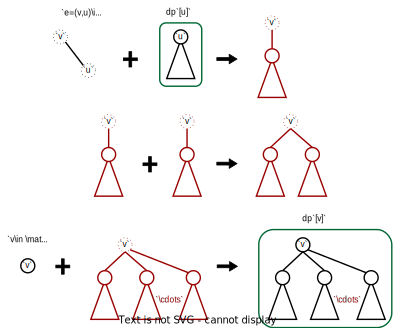

## `Rerooting<T>` クラス
全方位木DPの値(型 : `T` )が入っている配列だと思って使う. (`operator[](int v)`, `begin()`, `end()` がある. )

### コンストラクタ
```c++
Rerooting<T>::Rerooting<U,F1,F2,F3>(Graph g, F1 put_edge, F2 op, U ui, F3 put_vertex) // (1)
Rerooting<T>::Rerooting<U,F1,F2,F3>(Graph g, HeavyLightDecomposition hld, F1 put_edge, F2 op, U ui, F3 put_vertex) // (2)
```
|引数|概要|
|---|---|
|`Graph g`|[`Graph` クラス](Graph.hpp)|
|`HeavyLightDecomposition hld`|g を [重軽分解](HeavyLightDecomposition.hpp)したもの. <br> 省略できる (1). (ただし 内部で作ってる) |
|`put_edge(int v, int e, T t) -> U`| 頂点 v と v から出る辺 e の情報によってクラス `T` の値 `t` をモノイド `U` の元に変換|
|`op(U l, U r) -> U`|モノイド `U` の二項演算|
|`U ui`|モノイド `U` の単位元|
|`put_vertex(int v, U sum) -> T`| 頂点 v でモノイド `U` の総積をクラス `T` の値に変換|

### メンバ関数
|名前|概要|
|---|---|
|`operator[](int v)`| 頂点 v についての全方位木DPの値を返す.|
|`begin()`|全方位木DPの値配列のイテレータ.|
|`end()`|全方位木DPの値配列のイテレータ.|
|`operator()(int root, int v)`|頂点 root が根である場合の 頂点 v を根とする部分木のDP値を返す.|

## 問題例
[AtCoder Regular Contest 097 F - Monochrome Cat](https://atcoder.jp/contests/arc097/tasks/arc097_d) \
[AtCoder Regular Contest 022 C - ロミオとジュリエット](https://atcoder.jp/contests/arc022/tasks/arc022_3) \
[AtCoder Regular Contest 028 C - 高橋王国の分割統治](https://atcoder.jp/contests/arc028/tasks/arc028_3) \
[Educational DP Contest V - Subtree](https://atcoder.jp/contests/dp/tasks/dp_v) \
[Typical DP Contest N - 木](https://atcoder.jp/contests/tdpc/tasks/tdpc_tree) \
[square869120Contest #4 D - Driving on a Tree](https://atcoder.jp/contests/s8pc-4/tasks/s8pc_4_d)\
[NJPC2017 E - 限界集落](https://atcoder.jp/contests/njpc2017/tasks/njpc2017_e)\
[第二回全国統一プログラミング王決定戦本戦 D - 木、](https://atcoder.jp/contests/nikkei2019-2-final/tasks/nikkei2019_2_final_d) (根付き木ハッシュ) \
[yukicoder No.1153 ねこちゃんゲーム](https://yukicoder.me/problems/no/1153) (sp judge)

## 参考
[https://trap.jp/post/1702/](https://trap.jp/post/1702/)